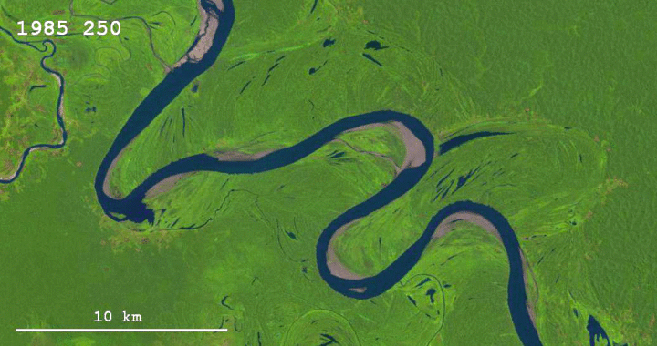

# IPCV Project Work: River Extraction from Satellite Images 
## 1. Introduction
The aim of this presentation is to show the details of my project work in Image Processing and Computer Vision (IPCV).

The goal of this project is to extract the *river surface* of any river (the cases are many, it is impossibile to optimise this algorithm for all of them) from a satellite image. 

We will analyse mainly two kinds of cases: 

- 1. **Clear images** in which the river is easy to distinguish from the surrounding land
- 2. **Unclear images** in witch the difference between the river surface and the land is minimum.

Sometimes those two cases can be applied to the same river since we will see that the season and the specific conditions in which the image is taken can *dramatically* chance the performance of the algorithm.

## 2. Methodologies Used 
In this chapter I will explain all the considerations and the solutions adopted in order to obtain the results that will be shown in the chapter 3.

### 2.1 Analysis of the problem

The first thing to notice about rivers (at least most of them) is that their colour compared to the *background* (the surrounding land) is quite uniform so it has the characteristic of what in other IPCV applications would be the background itself. 

This is the reason why I personally chose to use two segmentation techniques for this project, more precisely I used the **colour based segementation**. In this case woking on a greyscale image would have been too limiting for the algorithm so I kept the colour to better distinguish the river.

> I need to specify that in this case the focus is just the extraction of the river region so we will have an implicit segmentation: all the pixels not classified as "river" (or *foreground*) will be *background* pixels.

### 2.2 Calculating the reference colour
The two methods I used for the calculation of the reference colour are based on the small variations of the reference colour on the river region.
> The code allows to select the preferred mode writing *uniform* or *mahalanobis* in the global variable `distance_type`

The reference colour is selected manually since it has to be a pixel belonging to the river. It is better to choose a pixels that is in the deepest part of the river (far from the river banks).

This particular reference point is also the *starting point* of the scanning algorithm.

> It is possibile to select the position for the starting reference point manually by writing its coordinates in a dictionary that will work as a parameters container, specifying the filename in the `image` filed , and the coordinates in the `start_x` and `start_y` fields.

Once selected the pixel, its values for the R, G and B channels are used as a reference colour and stored in the global variables `ref_r`, `ref_g`, `ref_b`. 

#### 2.2.1 Uniform distance
In this case the reference colour is a set of possibilities spacing equally from the reference one for any channel. 

The reference colour is calculated as a **mean** of the intensities of each channel among a specific patch called the **training set**. A new training set is created and then passed to the function. It is usually a neighbourhood of the *starting point*.

An arbitrary value called `threshold_rgb` is used and tuned **manually** for the specific image depending on the condition of the satellite picture and the contrast with the surrounding land. 

The `threshold_rgb` value is a global variable that is used for all the channels.

#### 2.2.2 Mahalanobis distance
The Mahalanobis distance provides different thresholds for each channel depending by the variance of each colour in a test set (**training samples**) containing several pixels belonging to the river surface.

To **automatically** compute the thresholds I took an arbitrary neighbourhood of the reference pixel and calculate the standard deviation (instead of the variance, since they're proportional) for each channel (considering the *multivariate random variables* of the three channels **independent** from each other).

> NB: the neighbourhood I've considered to get the training samples is obtained through a **chessboard distance** 

Once obtained the threshold for each channel multiplying by 3 the value of each standard deviation (in order to cover the 99.7% of the variations on that channel), I also applied an arbitrary additive correction factor to the thresholds. This gives a *higher tolerance* to river variations that are not included in the **training box**.

> The correction factor can be set in the global variable `tolerance`.

### 2.3 Updating the reference colour
Some rivers don't have a uniform surface color but it can change gradually with its depth or because of an environmental factors. 

In these cases it is necessary to update the reference colour used for the distance calculation. The frequency of this update can vary depending by the colour gradient of the river and must be set manually to obtain better results. 

Since the reference colour is usually belonging to a reference point it is important to be able to automatise the choice of a new point during a scan of the river. 

There are two options in this case:

* If the selected distance is the **uniform distance** then the new reference colour will be calculated with a set of pixels that corresponds to the *check bin*.
* If the selected distance is the **Mahalanobis distance**, then a new computation will be done using the current *check bin* as training set.

#### 2.3.1 Performance tuning based on the given scenario
Using an high update rate may result in a dramatic drop of performances, which in this case is not critical but it can still be an issue. 

> The global variable responsible for this setting is `update_frequency`.

Some rivers change their colour just slightly or really slowly, in those cases it's better to choose an high value of the variable `update_frequency` since it represent how many iterations must be calculated before a new update.

### 2.4 Extraction: Scanning algorithm
My effort here was trying to prevent a blob analysis and labeling on the whole image in which every blob is a **connected** set of pixels within the threshold calculation performed by the *uniform* or *mahalanobis* function.

Beginning from the **starting point** detected by `start_x` and `start_y` I've implemented my own scanning algorithm, which works like an iterative expansion following the rules of the 4-neighbourhood or the 8-neighbourhood.

Its behaviour can be described with this set of instructions:

1. a new *check bin* is declared and the starring point is added to it
2. for each point in the check bin it is build an expansion of the neighbourhood (4-n or 8-n) and added to the *check bin* itself
3. each point in the *check bin* is checked calculating if the distance from the reference colour is smaller or higher than the threshold.
4. each point that is not in the river is put in the `out_river` bin which represents the **river banks**, otherwise it is put in the `in_river` bin, which represents the **river surface**.
5. each new point in the river is added to a new check bin.
6. start again from point 2. until the check bin is empty.

#### 2.4.1 River surface as a connected region
As we already know about the connected regions, the kind of neighbourhood considered determines the creation of a **4-connected** region or an **8-connected** region.

In this specific case I noticed that the best kind of connection for a region representing a river is a 4-connected region, obtained by the union of the check bins determined by the 4-neighbourhood expansion of each component belonging to them.

> I left the choice to select the 8-neighbourhood option to compare the results. It can be set just in the global variable `connection_type` writing *four_neighbourhood* or *eight_neighbourhood*.

#### 2.4.2 Plotting the scan results
In the algorithms there are two kinds of plotting that can be shown:

1. The real time plot, updating at a given frequency (customisable through the variable `plot_frequency`). This plot shows the starting point (blue triangle), the river banks (pink) and the check bin (red) in a given iteration. If the mahalanobis distance is chosen, the box used for learning the colour standard deviation is shown as well.
2. The final plot, that is an elaboration in which is shown the resulting river region and the river banks (blue). Each pixel of the surface of the river goes from green to red depending by how far it was from the reference colour given at the moment of its measurement.

> the real time plot can be activated/deactivated by writing *True* or *False* in the global variable `rt_plot`.

For simplicity in the Results section I'll show only the plots described in the point 2. Refer to the source code to check the real time plot as well.

## 3. Results
I'll now present some examples and interesting cases in which I applied this algorithm. The results will be shown as final elaboration plots. I will comment every plot and specify the specific options I've used to get the result.

### 3.1 River extraction in standard conditions
#### Example 1

In this first example the colour of the river is very different from the green land surrounding and the conditions are perfect for an extraction.

Here is shown a final frame of the real time plot, highlighting the box (green) used to learn the colour of the river and the river banks (pink).

> When I talk about *learning* I'm referring to different approaches depending on the method we are referring to: for the **uniform distance** it is just the mean among all the pixels in the box, for each channel, for the **Mahalanobis distance** we know that the colours are used to calculate the variances for each channel.

The final result is an highlighted river composed by shades of green and red. As mentioned earlier those colours transpose chromatically the distance from the reference colour. The river banks are highlighted in blue. This river was obtained with the Mahalanobis distance.

This is the final result we obtained with the uniform distance. It looks like the confidence of the algorithm is higher since the green colour is more evident here.

#### Example 2

In the next examples we will see some more difficult cases where the difference between the river and the land is not obvious anymore. The reference river here is the Po river. I'm going to make a short comparison between the same river in the same month of the year (June) in the 2020, 2021 and 2022. 

This comparison is interesting since it shows the climate change consequences but also the rising difficulty level of the process of river extraction the more the river is dry.

This result has been obtained with the mahalanobis distance without any correction. The extraction stops since the river slowly changes it's colour.

To overcome the previous result in this test I've just added an arbitrary constant to the thresholds calculated by the Mahalanobis distance. The result is much better and the river is almost completely extracted.

In this detail of the previous image is shown why the river wasn't completely extracted: the bridges in the city of Piacenza act as a "wall" for the river image and the scanning algorithm stops there. Also we can notice that there is a leak in the river region since some land has been recognised as river (false positive).

#### Example 3

This is the same Po river in June 2021. Something we can notice immediately is that the river surface has a completely different colour now and some parts of the river are more narrow than before. Lots of areas within the river banks are dry now. 

This result was obtained setting the uniform distance at a proper threshold. It is evident that the extraction is much less precise and confident than the previous case. It is not possibile to increase the threshold even more otherwise the scanning algorithms will consider most of the land part of the river.

In this detail from the previous image we can notice that paradoxically the label "Po River" wasn't an obstacle for the scanning algorithm but the color change in the area in which the river is more dry is a big problem instead. 
 

Here the same river has been tested with the Mahalanobis distance. It looks like in this case this method works better since it can lean better the characteristics of the variation in the river colour.
We can be confident with this outcome since here the river extraction stopped at the bridge like in the previous example.

### 3.2 River extraction in difficult conditions

The cases we're going to see now are particularly difficult because of some conditions that will be explained in the descriptions. To overcome those obstacles there will be described some key ideas in the last chapter of this document.

#### Example 4

In this case we have the same Po river in June 2022. As we can see the river is very dry and in many parts there are huge islands who came out as a consequence. Also the colour of the surface changed again and in many points is very similar to the terrain itself. 

Here we can see that the Mahalanobis distance used to obtain the result is not enough to scan the whole river without stopping very quickly. It is possible to notice that in the area where it stopped there is a huge "island" showing the river bed because of the dryness. Its presence changes rapidly the colour off the river and the algorithm stops.

Trying to solve the problem presented in the previous image I tried to add some tolerance to the Mahalanobis thresholds, but the result wasn't the best. It is possible to notice that the river has been correctly extracted but now many parts of the land are mistakenly included as well.

In this specific difficult case the uniform distance worked better. There are still several "leaks" in the river blob but it's easy to notice that there are much less now. 

> Even if the result of the uniform distance were better it is important to remember that the Mahalanobis distance calculates the thresholds automatically from the variance of the river colour but the uniform distance is a threshold that is set and tuned manually after several attempts.

#### Example 5

This last example is one of the most difficult. The first thing to notice here is the gradual change in the colour of the river and the similarity with some colours of the terrain. Also there are some clouds in the sky that could distract the scanning algorithm. 

The first try was a simple Mahalanobis distance. As we can see, the algorithm stops really quickly because of the changing colour.

Similar results can be obtained with the uniform distance, even after tuning the parameter for the threshold. 

Activating the option for the reference update, as described in the previous chapters, the situation improves dramatically and the whole river is now extracted.

It is still interesting to notice this detail of the previous picture: as imagined, the clouds represent a problem here since they confuse the algorithm and make those tiny rivers in the background unreachable.

The extraction obtained with the uniform distance and the manual tuning is even better. It is possible to appreciate how green the river is and therefore how confident the script is. 

In the correspondent detail of this image it is clear that even the detection of the parts of the river partially occluded by the clouds are extracted better.

## 4. Conclusions
This project was born from the idea that the rivers are particularly easy to distinguish in any image, at least for as human eye. The examples shown highlight some difficulties that could look trivial for an intelligent being but represent a real challenge for an algorithm like the one presented in this document.

By the way the different approaches and the numerous modifications, fix and improvements to the code took to some result that could be appreciable. 

It is interesting to notice that sometimes a simpler approach performs better than one that is based on getting some more detailed information. the multiple conditions in which a river can find itself in its course lead it to have unexpected variations in color. So learning the chromatic variation of the training set too faithfully could be a disadvantage at times.

### 4.1 Possible Evolutions of the project
As we saw the algorithm working we also noticed its evident limits: the river borders getting confused with the dry land, the bridges, the clouds and the dry points occluding the scanning and the multiple parameters to set for each different picture.

In this last chapter I will try to imagine some evolutions of the project in order to obtain some improvements against the issues listed here.

#### Multiple starting points and Scanners
One idea to overcome the problem of the obstacles like the bridges could be to simply put a starting point in each fragment of the river determined by the obstacles. The problem with this method is that it is not "smart" or automatic and the breaking points could be many and they should be set manually.

#### Implementing the principle of "Good Continuation"
An alternative idea to solve the problem of the obstacles is the "good continuation".
The Gestalt principle of good continuation explains why the human eye (and brain) knows that a figure represents a single object even if it is "interrupted" or partially occluded by something else. 
We prefer the *continuity* in images so we can imagine what happens "behind the obstacle" and solve easily the problem. 
This idea could be implemented in the algorithm as well with some effort. A starting point could be the determination of the direction of movement of the *check bin*, computing some sort of gradient of the positions of the *check bin* points in different iterations.

#### Real-Time river path analysis and correction
This idea is similar to the previous point and starts from the same assumptions: a river flows in one predominant direction only. With this fixed point it could be possible to prevent the "leaks" we saw in the previous examples since they simply go in a direction that is not the one of the river, so they must be land. 
In order to implement this we need to compute in real time the direction of the river (since it can change several times through the image).

#### Automatic reference colour update
The current algorithm has a specific variable for the update frequency (if activated) for the reference colour used for the distance calculations. This simple idea suggests to implement an automatic update of the reference colour whenever the algorithm stops the scanning. It is important in this case to determine better the stopping conditions of the iterative check.
